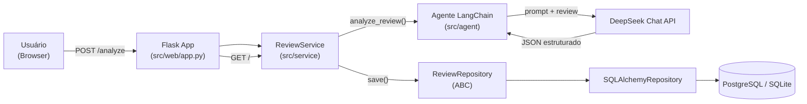

<div align="center">

# Review Analyzer — Análise Dimensional de Avaliações com LLM

**Aplicação full-stack em Python que usa um agente LLM (LangChain + DeepSeek) para transformar reviews de texto livre em metadados estruturados e auditáveis, prontos para treinar outros modelos de Machine Learning.**


</div>

---

##  Sobre o projeto

Reviews de usuários costumam ser subjetivas, verbosas e difíceis de aproveitar em pipelines de treino de modelos. Este projeto resolve esse problema com um **agente de anotação de dados** que recebe um texto livre e devolve uma avaliação estruturada em 4 dimensões independentes — **Riqueza Descritiva, Objetividade, Consistência Lógica e Utilidade Prática** — com scores, evidências extraídas do texto, nível de confiança e "avaliabilidade" por dimensão.

O resultado é persistido em banco de dados relacional, exposto via interface web e API documentada com Swagger, formando um pipeline completo de **geração de dados rotulados para ML**.

>  O foco deste projeto não é só "chamar uma LLM" — é a engenharia em volta dela: arquitetura em camadas, injeção de dependência, testes automatizados, containerização e um pipeline de CI/CD completo.

---

##  Arquitetura



**Fluxo:** o usuário envia uma review pela interface web → o `ReviewService` orquestra a chamada ao agente LangChain, que injeta o texto em um prompt de sistema especializado e consulta o modelo `deepseek-chat` → a resposta (JSON estruturado) é validada com Pydantic e persistida via um repositório abstrato, permitindo trocar SQLite por PostgreSQL apenas mudando uma variável de ambiente.

---

##  Funcionalidades

-  Envio de reviews em texto livre via formulário web
-  Análise dimensional automática (RD, OB, CL, UT) com scores de 0 a 10
-  Extração de evidências textuais associadas a cada dimensão
-  Estimativa de confiança e "avaliabilidade" por métrica, evitando respostas artificialmente confiantes
-  Detecção automática de domínios abordados (produto, logística, atendimento, pagamento etc.)
-  Histórico completo de análises, com visualização individual por ID
-  Documentação interativa da API via Swagger (`/apidocs`)
-  Suporte a SQLite (padrão, zero-config) ou PostgreSQL (produção)

---

##  Stack técnica

- **Linguagem:** Python 3.12
- **IA / Orquestração:** LangChain, LangChain-OpenAI (compatível com API DeepSeek)
- **Web:** Flask, Jinja2, Tailwind CSS (CDN)
- **API Docs:** Flasgger (Swagger/OpenAPI)
- **Persistência:** SQLAlchemy ORM, PostgreSQL (produção) / SQLite (dev)
- **Validação de dados:** Pydantic / Pydantic Settings
- **Testes:** Pytest, pytest-cov, pytest-mock
- **Qualidade:** Black, Ruff, pre-commit
- **Infra:** Docker, Docker Compose, GitHub Actions

---

##  Estrutura do projeto

```
review_langchain/
├── src/
│   ├── agent/            # Prompt de sistema e integração com a LLM (LangChain)
│   ├── database/          # Modelos, repositório abstrato e implementação SQLAlchemy
│   ├── service/            # Regras de negócio (orquestra agente + repositório)
│   ├── web/                # Rotas Flask, templates e Swagger
│   ├── config.py           # Configurações via variáveis de ambiente (Pydantic Settings)
│   └── schemas.py          # Contratos de dados (Pydantic)
├── tests/                  # Suíte de testes unitários (pytest)
├── Dockerfile               # Build multi-stage da imagem
├── docker-compose.yml        # App + Postgres + Adminer
├── Makefile                  # Atalhos para instalar, testar, lintar e subir containers
└── .github/workflows/         # Pipeline de CI/CD
```

---

##  Como executar

### Pré-requisitos
- Python 3.12+
- Uma chave de API da [DeepSeek](https://platform.deepseek.com/) (`DEEPSEEK_API_KEY`)
- Docker + Docker Compose (opcional, para usar PostgreSQL)

### Opção 1 — Local com SQLite (mais rápido)

```bash
git clone <url-do-repositorio>
cd review_langchain

pip install -r requirements.txt

export DEEPSEEK_API_KEY="sua-chave-aqui"

make run
# ou: PYTHONPATH=. python src/web/app.py
```

Acesse `http://localhost:5000` para a interface web e `http://localhost:5000/apidocs` para a documentação Swagger.

### Opção 2 — Docker + PostgreSQL (ambiente completo)

```bash
cp .env.example .env   # ajuste se necessário
export DEEPSEEK_API_KEY="sua-chave-aqui"

make docker-up
```

- App: `http://localhost:5000`
- Adminer (gerenciador de banco): `http://localhost:8080`

---

##  Testes e qualidade de código

```bash
make test      # roda a suíte pytest
make lint      # checa formatação (Black) e lint (Ruff)
make format    # aplica formatação automática
```

A suíte cobre o agente LangChain (com mocks da chamada à LLM), o serviço de negócio, o repositório SQLAlchemy e as rotas Flask. O pipeline de **CI/CD** no GitHub Actions executa lint, testes com cobertura e build da imagem Docker a cada push/PR nas branches `main`/`master`.

---

##  Possíveis próximos passos

- [ ] Autenticação e multi-usuário
- [ ] Exportação do dataset rotulado (CSV/JSONL) para uso direto em fine-tuning
- [ ] Dashboard analítico com distribuição de scores por dimensão
- [ ] Suporte a múltiplos provedores de LLM (OpenAI, Anthropic, Ollama)

---

##  Autor

Desenvolvido como projeto de estudo/portfólio para demonstrar integração de LLMs em aplicações backend reais, com foco em arquitetura limpa, testabilidade e práticas de engenharia de software.

**Contato:** https://www.linkedin.com/in/vitor-hugo-dias-santos-2b2b7327b/.
